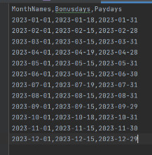

# PHP-command-line-utility
command-line utility to help a fictional company determine the dates on which they need to pay salaries and bonuses to their Sales Department. 

Output in CSV File for today date "2023-01-10":

Start with writing in command line:

php command.php outputfilename.csv

By Samane Sharif Monfared